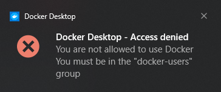
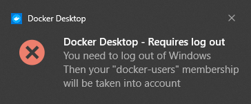
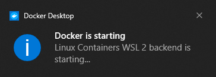

How to fix that error: 


Docker Desktop - Access denied
You are not allowed to use Docker.
You must be in the "docker-users" group



# TL;DR;
Run command



net localgroup docker-users YOUR_ACCOUNT_NAME /add

 

and restart your PC.

# A bit longer story
We can discuss longet about that, but I think there is not too much sense, becouse solution from TL;TR; is working, but... 

There are a solution in internet that doesn't work for me. So I would like to show you it as alternative to convince you, it is easier to use command line (also becouse you try to run docker and there are more commands)

1. Open `Computer management` then go to `Local users and groups`
   * It failed for my PC, becaouse I didn't install English version (my fault, I am changing it right now)
   * It failed becaouse I have Windows 10 Home and there is no that options (my fault, I will change it later)
2. Run `lusrmgr.msc` then manage user accounts
   * It failed becouse the feature is not suported on my Windows 10 version

I had no alternative. 

# So how to add user to \"docker-users\" group on widows

1. You have an error: 

   
   * Run command `net localgroup docker-users YOUR_ACCOUNT_NAME /add`

2. Then you have error: 

   
    * Log out and login again or just restart your PC

3. Run Docker Desktop after restart to see: 

   

And everything should work. 

If you have any different problem, leave a comment. 
